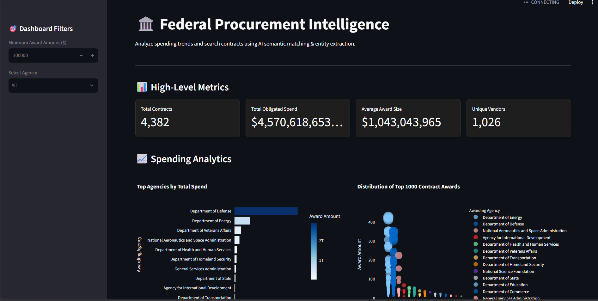

#  Federal Procurement AI Search Engine



##  Overview
An end-to-end Data Engineering and NLP platform designed to analyze U.S. federal procurement data. This application ingests contract data, generates dense vector embeddings for semantic search, and extracts key entities (Organizations, Locations, Products) using Natural Language Processing. 

The backend is powered by **DuckDB** for lightning-fast analytical queries, and the entire application is fully containerized using **Docker** for seamless deployment.

---

##  Key Features
* ** AI Semantic Search:** Find contracts using natural language queries via `sentence-transformers` (Cosine Similarity).
* ** Named Entity Recognition (NER):** Automatically extracts and tags Organizations, Locations, and Technologies from unstructured contract text using `spaCy`.
* ** OLAP Database:** Utilizes `DuckDB` to run high-performance SQL queries directly against the data, bypassing the memory limits of Pandas.
* ** Interactive Dashboards:** Dynamic KPI tracking and Plotly visualizations built with `Streamlit`.

---

##  Tech Stack
* **Language:** Python 3.10
* **Data Engineering & Analytics:** DuckDB, Pandas, SQL
* **Machine Learning / NLP:** spaCy (`en_core_web_sm`), Sentence-Transformers (`all-MiniLM-L6-v2`), Scikit-Learn
* **Frontend UI:** Streamlit, Plotly
* **DevOps:** Docker, Git

---

##  How to Run Locally

###  Quick Start (Run All in Terminal)
```bash
git clone [https://github.com/YOUR-USERNAME/federal-procurement-ai.git](https://github.com/YOUR-USERNAME/federal-procurement-ai.git)
cd federal-procurement-ai
python init_db.py
docker build -t gov-procure-app .
docker run -p 8501:8501 gov-procure-app